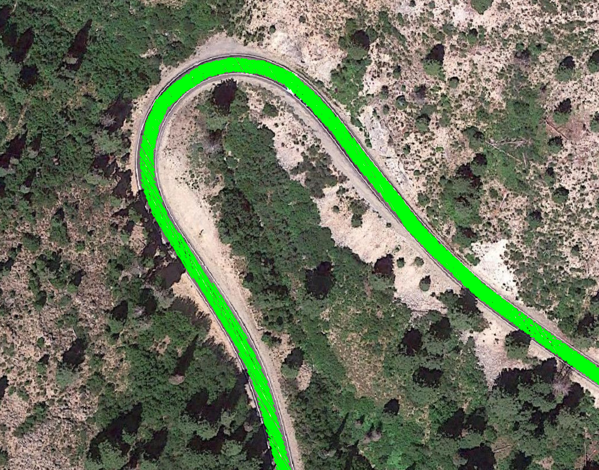
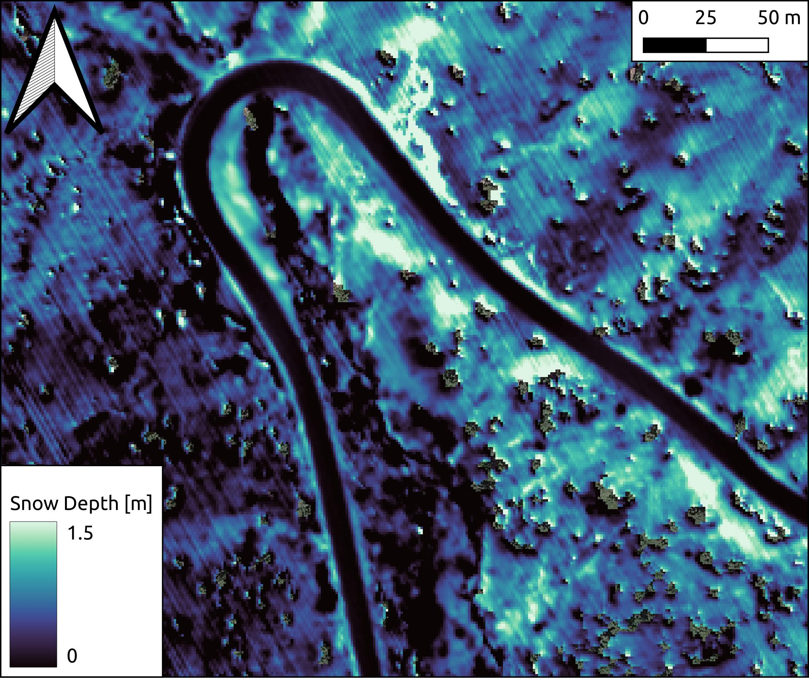

# ice-road-copters :helicopter:
The goal of this program is to utilize existing USGS 3DEP 1m topography data (via [py3dep](https://github.com/hyriver/py3dep)) and Ames Stereo Pipeline ([ASP](https://github.com/NeoGeographyToolkit/StereoPipeline)) software to accurately align snow-on airborne lidar point clouds to real world coordinates without the use of ground control points.


For our case, we used prior knowledge that HWY-21 running through our study site is kept snow-free for a majority of the year, thus making excellent virtual ground control points for post-processing in ASP.


After running pdal processing and ASP post-processing, we are able to generate accurate snow depth maps with sub cm road differences



###  Setting things up! :hammer:

#### Downloading ASP precompiled binaries
1. Download latest stable build (Linux or OSx): https://github.com/NeoGeographyToolkit/StereoPipeline/releases and unzip the folder into the ice-road-copters directory
2. Rename this folder as `ASP` and remove the zipped file


#### Setting up Conda environment 

```
$ conda env create -f iceroad_env.yaml
$ conda activate iceroad
```